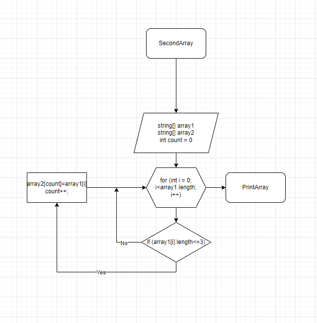

**FinalTask**
===
_**Задача:**_
===
Написать программу, которая из имеющегося массива строк формирует массив из строк, длина которых меньше либо равна 3 символа. Первоначальный массив можно ввести с клавиатуры, либо задать на старте выполнения алгоритма. При решение не рекомендуется пользоваться коллекциями, лучше обойтись исключительно массивами

_**Описание алгоритма решения:**_
===
Сначало объявляется два массива: одинаковой длинны . После, метод , в котором цикл равный длине массива, внутри цикла проверка условия ( <=3 ), если да, элемент первого массива заносится в count элемент второго массива. Переменная count чтобы поочередно закидывать из первого массива во второй и чтобы потом не было пробелов. После присвоения увеличивается переменная count на +1 и возвращается к циклу for в котором i увеличивается ++. И так проверяется до конца.

+ __Программа находится в папке TASK/Program.cs.__
 
 + __Блок-схема__
 
